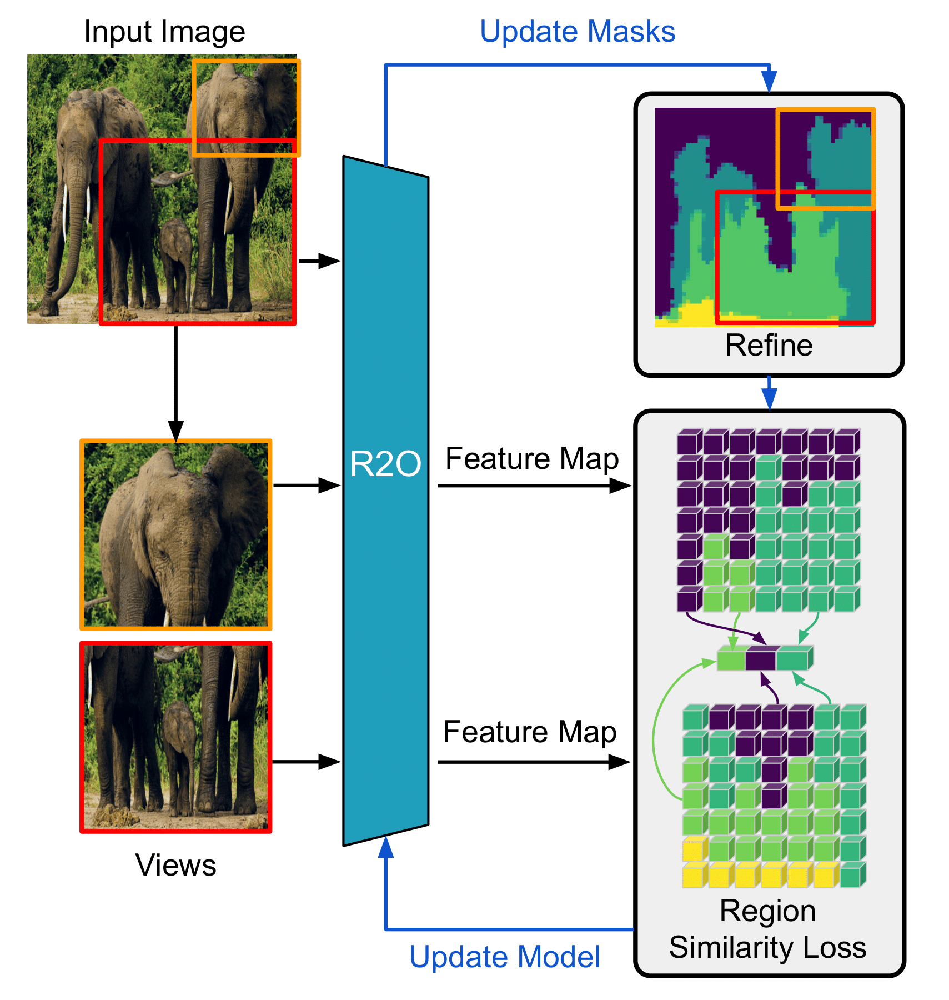

# Region-to-Object (R2O)

PyTorch implementation of [Refine and Represent: Region-to-Object Representation Learning](https://arxiv.org/abs/2208.11821).

Installation of [Apex](https://github.com/NVIDIA/apex) is required to enable DDP.

To log metrics to [wandb](https://github.com/wandb/client) switch to `enable_wandb:True` in `train_imagenet_300.yaml`

<p align="left">
  
</p>

## Requirements

```
python>=3.9
pytorch>=1.10.0
torchvision>=0.11.0
joblib
scikit-image
matplotlib
opencv-python
tqdm
tensorflow
pyyaml
tensorboardx
wandb
pycocotools
classy_vision
```

This repo uses `torch.distributed.launch` for pretraining:

```bash
python -m torch.distributed.launch --nproc_per_node=4 --nnodes=32 --node_rank=0 --master_addr="" --master_port=12345 r2o_main.py --cfg={CONFIG_FILENAME}
```

## Dataset Structure

```none
imagenet
├── images
│   ├── train
│   │   ├── n01440764
│   │   ├── ...
│   │   ├── n15075141
│   ├── val
│   │   ├── n01440764
│   │   ├── ...
│   │   ├── n15075141
```

## Pretrained Weights
We release pretrained weights pretrained on ImageNet-1k for 300 epochs in original, torchvision and d2 format. [Huggingface](https://huggingface.co/KonstantinosKK/r2o)

The evaluation baselines are as follows

|         Metric         | Value  |
|------------------|---|
|  PASCAL VOC mIoU | 77.3 |
| Cityscapes mIoU  | 76.6  |
|    MS COCO $\text{AP}^{\text{bb}}$ | 41.7  |
|    MS COCO $\text{AP}^{\text{mk}}$ |  38.3 |

## Citing this work

```
@misc{gokul2022refine,
  title = {Refine and Represent: Region-to-Object Representation Learning},
  author = {Gokul, Akash and Kallidromitis, Konstantinos and Li, Shufan and Kato, Yusuke and Kozuka, Kazuki and Darrell, Trevor and Reed, Colorado J},
  journal={arXiv preprint arXiv:2208.11821},
  year = {2022}
}
```

## Reproduce Results

We use [MMSegmentation](https://github.com/open-mmlab/mmsegmentation) for PASCAL VOC and Cityscapes semantic segmentation. We use [detectron2](https://github.com/facebookresearch/detectron2) for MS COCO object detection and instance segmentation. The corresponding config can be found in `evaluation` folder.

## Acknowledgement

This repo is based on the BYOL implementation from Yao: https://github.com/yaox12/BYOL-PyTorch and K-Means implementation from Ali Hassani https://github.com/alihassanijr/TorchKMeans
